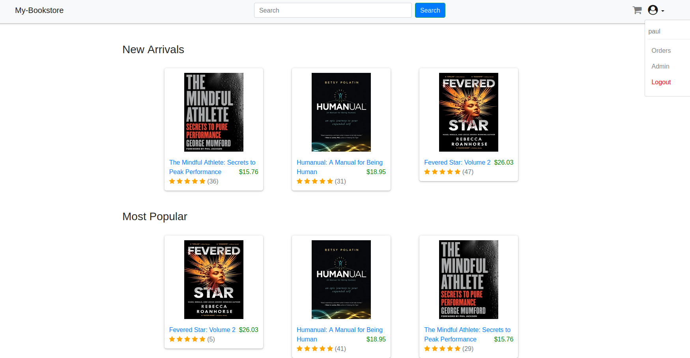
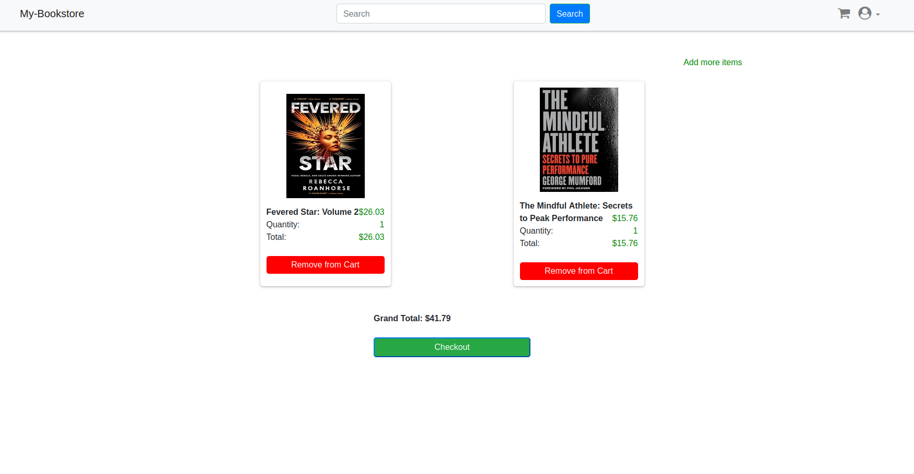
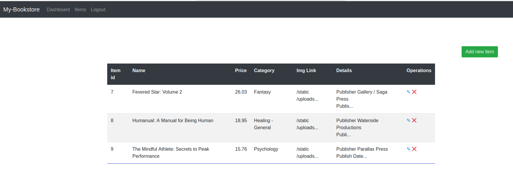

# My bookstore on Flask
The store is implemented on the Flask framework using the ORM SQLAlchemy.


## Functional
- Registration and authorization;
- Purchasing goods (cart and shopping list);
- Product search;
- Administrator mode (product management).

## Site page examples





## Requirements
- Python;
- Flask;
- SQLAlchemy;
- Docker / docker-compose (optional).

## Installation
To run the application, clone the repository and use the command:
```bash
pip install -r requirements.txt
```
Change the configuration in the file (optional):
```bash
.env
```
Run application in file:
```bash
app.py
```

## Alternative installation
```bash
docker-compose up --build
```